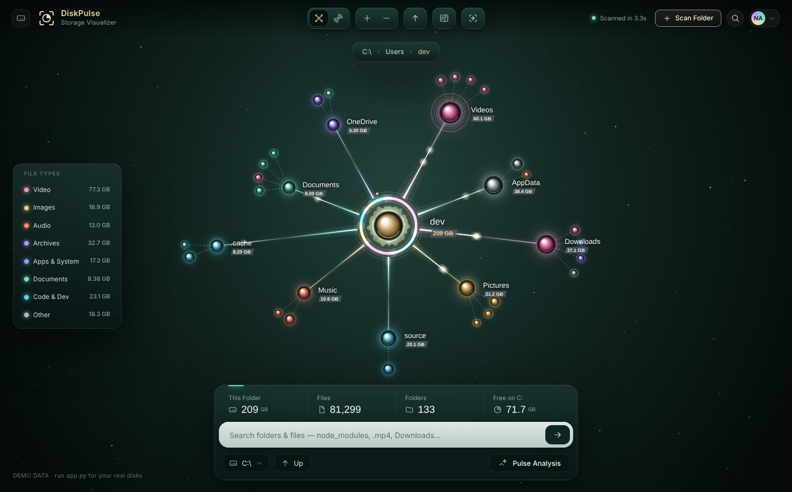
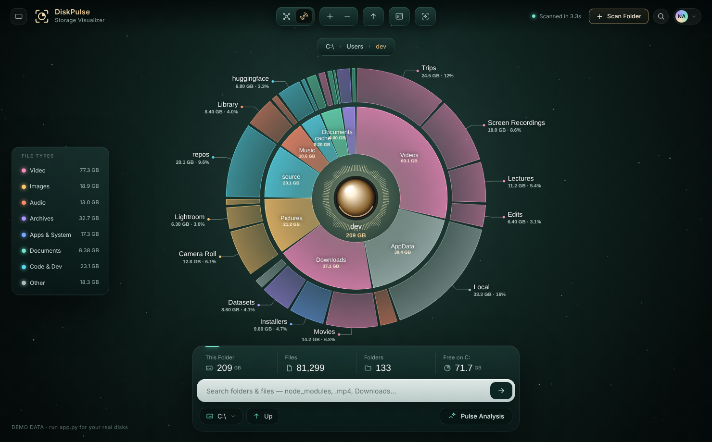
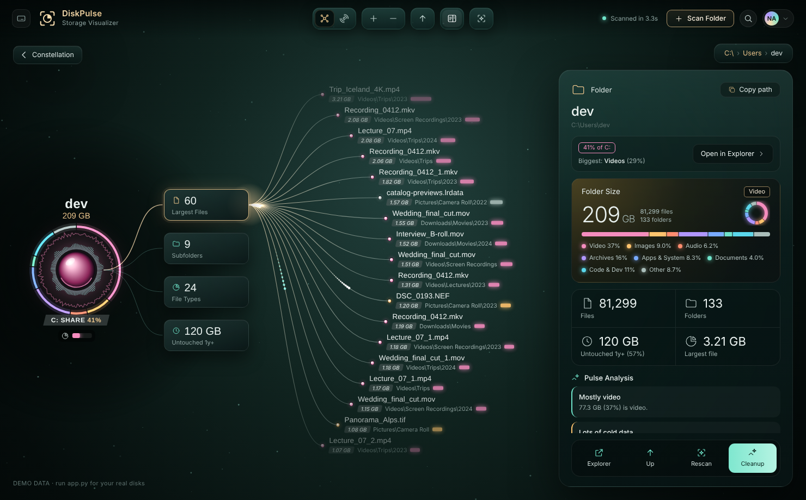

# DiskPulse: Disk Space Visualizer

A Windows desktop app that shows where your disk space goes as an animated, explorable constellation. It uses the same design as [RepoPulse](../git_dashboard/).





## Features

- 💽 **Drive picker**: every drive shows a usage ring (red when nearly full), plus a quick Home-folder scan
- 📡 **Live scan**: shows size and file counts as it scans, with a radar sweep animation. The scan runs on 8 threads
- 🌌 **Constellation view**: folders orbit the current folder, sized by space used and colored by their dominant file type. A storage ring shows each folder's share, and the satellites around each folder are its subfolders and largest files
- 🎯 **Sunburst view**: two levels of folders as glowing rings. Click any slice to dive in
- 🔭 **Details view**: largest files, subfolders, file types and files untouched for a year, plus a type breakdown and insights
- ✨ **Pulse Analysis**: cleanup suggestions such as `node_modules` and `.venv` folders, temp and cache folders, the Recycle Bin, old installers in Downloads, huge files and cold data
- 🔍 **Search**: by name (`node_modules`) or extension (`.mp4`) across the scanned tree
- 🗑️ **Safe cleanup**: files and folders go to the **Recycle Bin** after you confirm, so you can always restore them
- 🎨 **File-type filter**: toggle categories (Video, Images, Audio, Archives, Apps, Docs, Code, Other) in the side panel

## Run

Requires Python 3.10+.

```bat
run.bat
```

Or manually:

```bash
pip install -r requirements.txt
python app.py          # add --debug for devtools
```

## Build an .exe

```bat
build.bat
```

This produces `dist\DiskPulse.exe`. GitHub Actions also builds it automatically and publishes it as the `diskpulse-latest` release.

## Shortcuts

| Key | Action |
| --- | --- |
| `1` / `2` | Constellation / Sunburst view |
| `Backspace` | Up one folder |
| `D` | Folder details |
| `I` | Pulse Analysis |
| `R` | Rescan |
| `/` | Search |
| `F` | Fit to window |
| `Esc` | Back / close |

Tip: scan a folder as Administrator to include protected system folders. Opening `ui/index.html` in a browser runs it with demo data.
