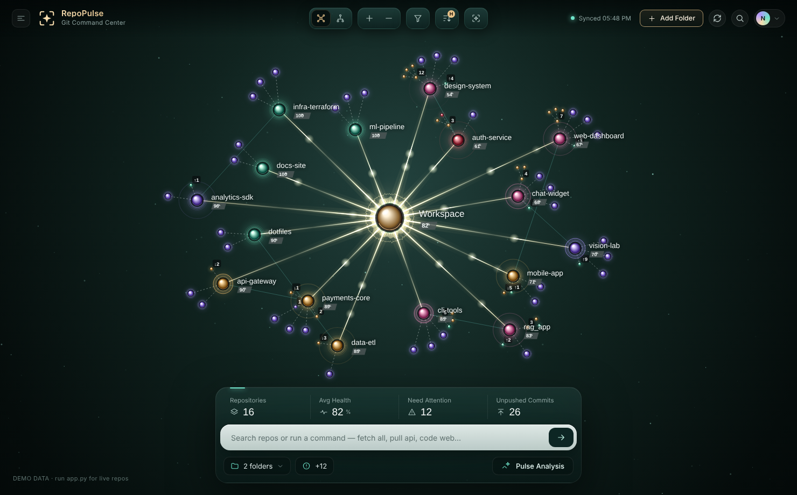
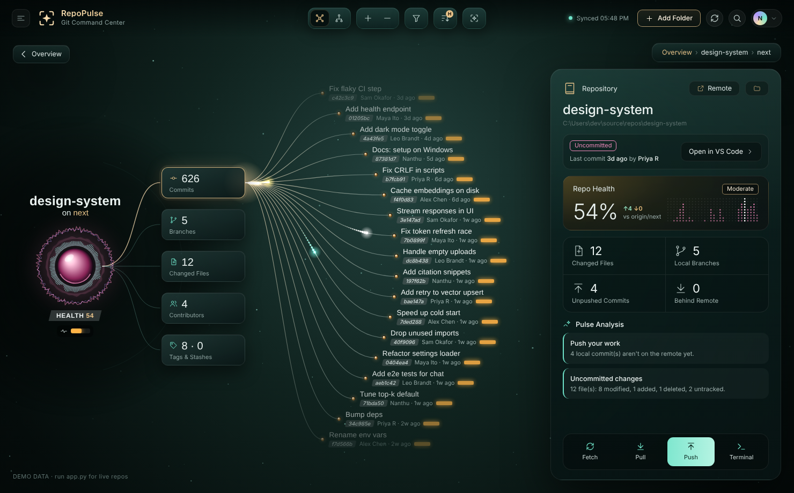

# RepoPulse: Git Repo Dashboard

A Windows desktop dashboard that shows the status of all your local git repos as a living constellation.




## Features

- 🌌 **Constellation view**: every repo orbits your workspace. Orb color shows status (clean, uncommitted, unpushed, behind, conflicts); satellites show branches, changed files, ahead/behind counts and stashes
- 🧬 **Cluster view**: groups repos by status
- 🔭 **Focus view**: click a repo for commits, branches, changed files and contributors, a health score, a 30-day activity matrix and insights
- ⚡ **Actions**: fetch, pull (`--ff-only`), push, open in VS Code, terminal, Explorer or the remote URL
- ✨ **Pulse Analysis**: workspace-wide alerts for conflicts, repos that need a pull, unpushed work, missing upstream and stale repos
- ⌨️ **Command bar**: `fetch all`, `pull api`, `push web`, `code rag`, `term docs`, `scan`, or type to search

## Run

Requires Python 3.10+ and git on `PATH`.

```bat
run.bat
```

Or manually:

```bash
pip install -r requirements.txt
python app.py          # add --debug for devtools
```

On first launch it scans `~/source/repos`, `~/Documents/GitHub`, `~/projects`, `~/code`, `~/dev` and `~/repos` if they exist; otherwise it scans your home folder, 4 levels deep. Use **Add Folder** to choose other roots. Settings are saved to `~/.repopulse.json`.

## Build an .exe

```bat
build.bat
```

This produces `dist\RepoPulse.exe`, a single-file app with no console window.

## Shortcuts

| Key | Action |
| --- | --- |
| `/` | Focus the command bar |
| `R` | Rescan |
| `F` | Fit the graph to the window |
| `I` | Toggle Pulse Analysis |
| `Esc` | Back / close |
| Scroll / drag | Zoom / pan |

Opening `ui/index.html` directly in a browser runs it with demo data.
